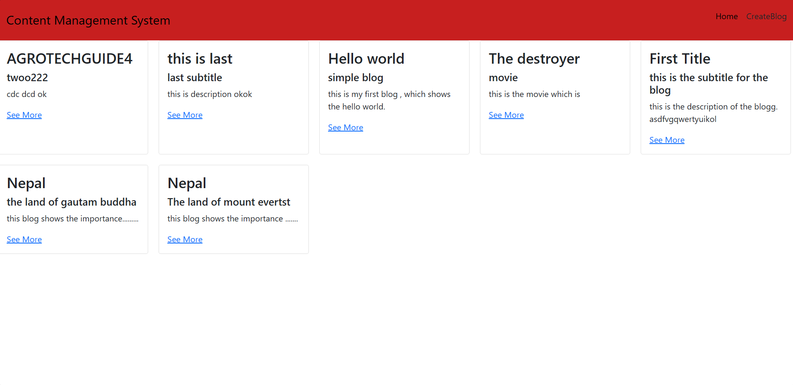

# Content-Management-System:

This is basic mern project, which implements CRUD operation using NodeJs. In this project, i have created 5 APIs for Creating blogs, View(Read) blogs, Updating blogs and Deleteing blogs


## How to Run:
To run this, 
- Firstly, complete the backend setup from [Here](https://github.com/yogendrabaskota/Content-Management-System-Backend.git)

- Clone this repo in (any folder) in your computer.
- Open that folder in VSCode. 

- Open Terminal and run following command 

### TO install all the required dependencies of project :
```https 
  npm install
``` 
 ### TO run the project :
```https 
  npm run dev
``` 


 ## Output :
 #### Home page: 
  

#### Update page:
  


## Feedback
  If you have any feedback, please reach out to me at yogendrabaskota18@gmail.com  


